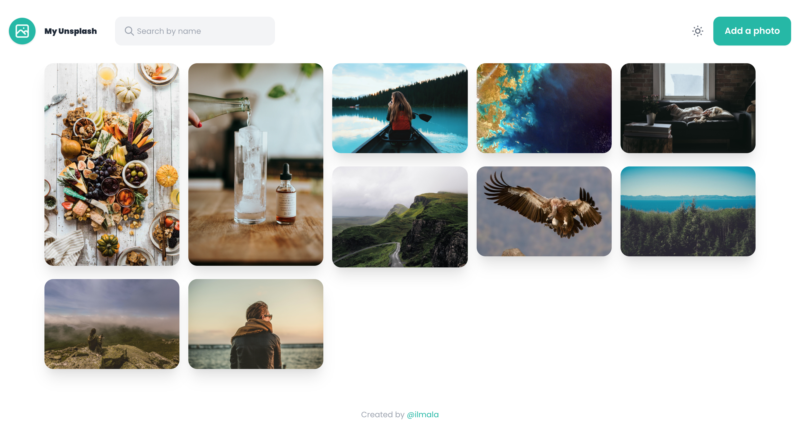
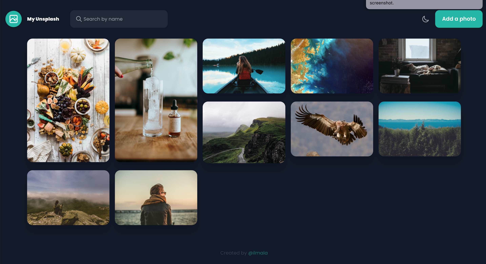
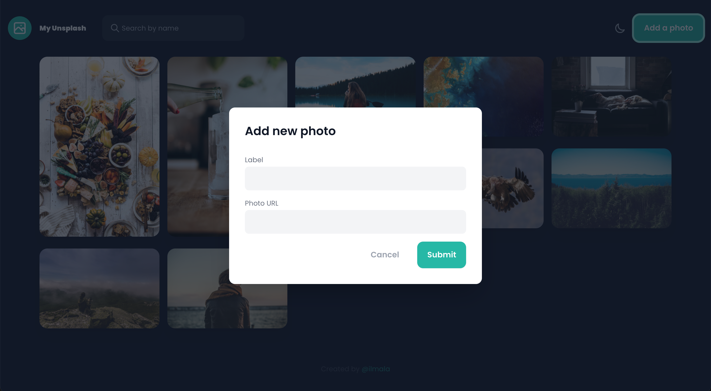

<!-- Please update value in the {}  -->

<h1 align="center">My Unsplash</h1>

<div align="center">
   Solution for a challenge from  <a href="http://devchallenges.io" target="_blank">Devchallenges.io</a>.
</div>

<div align="center">
  <h3>
    <a href="https://devchallenges-my-unsplash.herokuapp.com/">
      Demo
    </a>
    <span> | </span>
    <a href="https://devchallenges.io/solutions/98p75Dg9NHzotLxOBmmx">
      Solution
    </a>
    <span> | </span>
    <a href="https://devchallenges.io/challenges/rYyhwJAxMfES5jNQ9YsP">
      Challenge
    </a>
  </h3>
</div>

<!-- TABLE OF CONTENTS -->

## Table of Contents

- [Overview](#overview)
    - [Built With](#built-with)
- [Features](#features)
- [How to use](#how-to-use)
- [Contact](#contact)
- [Acknowledgements](#acknowledgements)

<!-- OVERVIEW -->

## Overview





In this project I learned:

* Use Dark Mode with Tailwind.
* Create Vue Modal with transition made with tailwind.

This project was a lot of fun. It could go on for months to add new features!

### Built With

<!-- This section should list any major frameworks that you built your project using. Here are a few examples.-->

- [Laravel 8](https://laravel.com//)
- [Vue.js](https://vuejs.org/)
- [Tailwind](https://tailwindcss.com/)

## Features

<!-- List the features of your application or follow the template. Don't share the figma file here :) -->

This application/site was created as a submission to a [DevChallenges](https://devchallenges.io/challenges) challenge. The [challenge](https://devchallenges.io/challenges/rYyhwJAxMfES5jNQ9YsP) was to build an application to complete the given user stories.

* User can see a list of photos in the masonry layout that I have added
* User can add a new photo to the list - the new photo should be on top of the list
* User can search for photos by label
* User can go hover a photo, user can see a label and a delete button
* User can delete images
* (optional) User when delete an image, can enter password
* (optional) User can choose light or dark theme

## How To Use

<!-- Example: -->

To clone and run this application, you'll need [Git](https://git-scm.com) and [Node.js](https://nodejs.org/en/download/) (which comes with [npm](http://npmjs.com))
for frontend. You'll need [PHP](https://www.php.net/) v7.3 or up and [Composer](https://getcomposer.org/) for backend API installed on your computer or VM.
From your command line:

```bash
# Clone this repository
$ git clone https://github.com/ilmala/image-uploader

# Install and compile frontend dependencies
$ npm install && npm run dev

# Install backend dependencies
$ composer install

# Run backend test
$ php artisan test
```
## Contact

- GitHub [@ilmala](https://github.com/ilmala)
- Twitter [@lucamalattia](https://twitter.com/lucamalattia)
